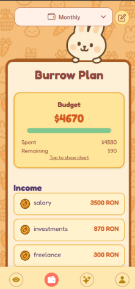
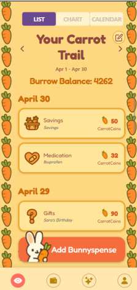
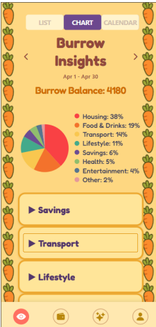
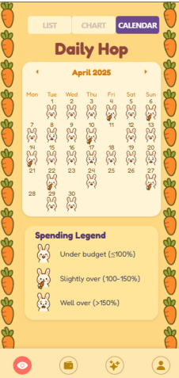
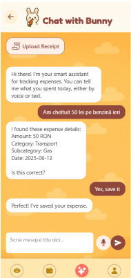
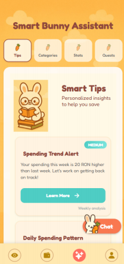
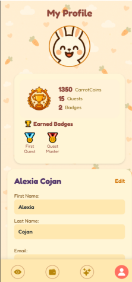
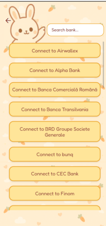

# 🐰 BunnyBuddy – Smart Finance Assistant

**BunnyBuddy** is a comprehensive mobile application that combines personal financial management with advanced artificial intelligence elements, gamification, and natural interaction. It's designed for modern digital users seeking an intuitive, friendly, and efficient personal budgeting experience.

The application replaces rigid interfaces and boring manual systems with a personalized, AI-powered virtual financial assistant that motivates you, educates you, and gives you full control over your expenses.

---

## 🧭 Main Navigation – 4 Functional Tabs

The application is divided into four main modules accessible from the navigation bar:

---

### 📌 1. Budget Tab

This module helps you create and manage a personalized monthly budget:

- **Budget creation in 4 steps**: guided process with clear UI where the user defines the total amount, chooses desired categories, and allocates the budget for each category.

- **Budget editing**:
  - Add/delete categories.
  - Dynamic adjustment of amounts for each category.
  - Firebase saving with real-time synchronization.

- **Budget visualization**:
  - **Pie Chart** showing percentage distribution of budget across categories.
  - **Progress bar** displaying spent percentage.

---

### 📌 2. Overview Tab

The "Overview" tab provides a complete expense analysis through three specialized pages:

#### 📋 List View

- Expenses are displayed in descending order by days.
- Navigation through previous months with side arrows.
- **Add Bunnyspense** button allows manual expense addition through an intuitive form.

#### 📊 Chart View

- Expense visualization grouped by categories.
- Interactive chart automatically generated based on Firestore data.

#### 🗓 Calendar View

- Monthly calendar with thematic icons for each day:
  - 🟢 Good Day – <33% of daily budget spent.
  - 🟡 Medium Day – between 33% and 75%.
  - 🔴 Bad Day – over 75% of daily budget spent.

---

### 📌 3. AI Tab

This module is the soul of the application and integrates all AI, gamification, and personalized feedback components:

#### 💬 Tips & Categories

- **Tips**: automatically generated recommendations based on general behavior.
- **Categories**: category-specific tips for each expense type.

#### 📈 Stats

- Comparative statistics between months and category distributions.
- Personalized trends and motivational thematic messages.

#### 🎯 Quests

- Daily, weekly, and monthly quests:
  - Ex: "Spend less than 50 RON today", "Don't exceed 30% of your food budget this week".
  - Reward: **CarrotCoins**, XP, badges, levels.

---

#### 🤖 Intelligent Assistance

##### 🗨 AI Chatbox

- Expense input via text.
- Supports **Romanian and English**.
- Custom NLP:
  - Custom `ro-en.ts` files for translations.
  - Manually created financial dictionary.
  - Detects: amount, category, subcategory, description, date.

##### 🎙 Voice Assistant

- RO/EN vocal support (based on `expo-speech`).
- Voice → text → NLP conversion.
- Hands-free commands.

##### 📷 OCR Scanner

- Implementation with Tesseract.js.
- Scans receipts/bills and automatically extracts:
  - Total amount, date, category, subcategory.
- Text cleaning + semantic classification + intelligent mapping.

---

### 📌 4. Profile Tab

- Displays and allows editing of user data.
- Bank account connection (GoCardless):
  - Automatic transaction extraction (active only in certain countries).
- **Badge Wall**: gallery of earned badges.

---

## 🎮 Gamification System

Gamification is completely and subtly integrated into the BunnyBuddy experience:

### 🔑 Key Elements

- **CarrotCoins**: internal currency obtained from quests and used for progress.
- **Daily / Weekly / Monthly Quests**: dynamically generated AI missions.
- **Badges and levels**: reward for positive financial behavior.

### 🎨 Thematic Naming

| Classic Functionality | BunnyBuddy Name          |
|-----------------------|--------------------------|
| Add expense           | Add a Bunnyspense        |
| Calendar              | Daily Hop                |
| Expense history       | Carrot Trail             |
| AI Assistant          | Bunny Assistant          |
| Budget visualization  | Burrow Insights          |

### 💬 Thematic Messages

- *"Any notes, bunbun?"* – in the expense form.
- *"Every carrot counts!"* – in the Tips section.
- *"Small steps lead to big bunny hops!"* – in the Quests area.
- *"Hopping your spending patterns?"* – in the Categories area.
- *"You're doing bunny-tastic with your budget!"* – in the Stats area.

### 🎯 Design

- Animated bunnies, pastel colors, and friendly icons.
- Motivational messages and visual metaphors in all application components.

---

## � Architecture and Technologies

- **Frontend**: React Native + Expo SDK + TypeScript
- **Backend**: Firebase (Auth, Firestore, Storage)
- **Routing**: expo-router
- **State Management**: Context API + AsyncStorage
- **AI/NLP**: Custom `.ts` files for financial interpretation
- **OCR**: Tesseract.js
- **Voice**: expo-speech

---

## 🗂 Code Structure

```plaintext
/auth         – Authentication and account management
/ai           – NLP, Voice Assistant, OCR
/bank-connect – GoCardless integration
/tabs         – Structure of the 4 tabs
/screens      – Each main view
/components   – Reusable UI components
/utils        – Helpers, types, translations, AI classifiers
```

---

## 🧪 Local Installation
```
git clone https://github.com/username/BunnyBuddy.git
cd BunnyBuddy
npm install
npx expo start
```
🔐 Create a Firebase account and add firebaseConfig.ts.

---

## 🛡️ Security
-Firebase authentication with persistent session.
-Firestore rules for document-level protection.
-AsyncStorage for encrypted local storage.

---

## 📸 Demos
🎞️ [Budget creation](https://drive.google.com/drive/folders/1zD9nYU2fS9u6U8J6LleyPth1kbmpWRdg?dmr=1&ec=wgc-drive-hero-goto)
🎞️ [chatbox](https://drive.google.com/drive/folders/1zD9nYU2fS9u6U8J6LleyPth1kbmpWRdg?dmr=1&ec=wgc-drive-hero-goto)
🎞️ [OCR](https://drive.google.com/drive/folders/1zD9nYU2fS9u6U8J6LleyPth1kbmpWRdg?dmr=1&ec=wgc-drive-hero-goto)
🎞️ [Add Bunnyspense + Card](https://drive.google.com/drive/folders/1zD9nYU2fS9u6U8J6LleyPth1kbmpWRdg?dmr=1&ec=wgc-drive-hero-goto)
🎞️ [Ai pages](https://drive.google.com/drive/folders/1zD9nYU2fS9u6U8J6LleyPth1kbmpWRdg?dmr=1&ec=wgc-drive-hero-goto)

## 🖼️ Some Screenshots

<table>
  <tr>
    <td></td>
    <td></td>
    <td></td>
  </tr>
  <tr>
    <td></td>
    <td></td>
    <td></td>
  </tr>
  <tr>
    <td></td>
    <td></td>
    <td></td>
  </tr>
</table>


---

## 👩‍💻 Author
Application developed by Cojan Alexia Ilaria
License – Faculty of Mathematics and Computer Science
Babeș-Bolyai University, Cluj-Napoca
Coordinator: Prof. Univ. Dr. Lazăr Ioan
